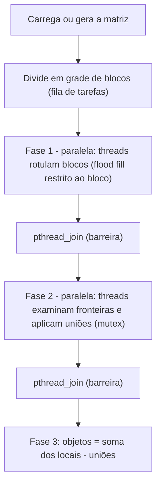

# Contagem paralela de objetos em uma matriz binária

Trabalho prático de **Sistemas Operacionais – 2026/II** (PUCRS, Escola Politécnica, Prof. Filipo Novo Mór).

Conta os **objetos** (componentes conexos de células `1`, com **conectividade 8**) de uma matriz binária, em duas versões funcionalmente equivalentes:

| Versão | Arquivo | Estratégia |
|---|---|---|
| Sequencial | [`src/conta-objetos-sequencial.c`](src/conta-objetos-sequencial.c) | Flood fill iterativo com pilha explícita |
| Paralela | [`src/conta-objetos-paralelo.c`](src/conta-objetos-paralelo.c) | **Pthreads**: blocos em fila dinâmica, rotulação local, consolidação das fronteiras com union-find protegido por mutex |

O relatório completo está em [`RELATORIO_TECNICO.md`](RELATORIO_TECNICO.md).

## Autoria

| Nome | Matrícula |
|---|---|
| Betina Borchardt Kusler | 23200006-7 |

## Compilação

Requer um compilador C (gcc ou clang) e um sistema POSIX. Testado em macOS 26.3 (Apple clang 17) e em Linux (gcc 13).

```bash
make            # compila as duas versões (-std=c89 -Wall -Wextra -pedantic -O2)
make clean
```

## Execução

```bash
# Sequencial
./conta-objetos-sequencial <arquivo>
./conta-objetos-sequencial -g <linhas> <colunas> <densidade> <semente>

# Paralela
./conta-objetos-paralelo [-t threads] [-b blocos_lin blocos_col] [-v] <arquivo>
./conta-objetos-paralelo [-t threads] [-b blocos_lin blocos_col] [-v] -g <linhas> <colunas> <densidade> <semente>
```

| Opção | Significado | Padrão |
|---|---|---|
| `-t N` | quantidade de threads trabalhadoras | 2 |
| `-b L C` | grade de blocos (L faixas de linhas × C faixas de colunas) | `(2·N) × 2` |
| `-v` | modo explicativo: mostra blocos, rótulos locais, uniões e rótulos globais (matrizes até 40×40) | desligado |
| `-g L C d s` | gera matriz aleatória L×C com densidade `d` e semente `s` (reproduzível) | — |

Exemplo:

```bash
./conta-objetos-sequencial tests/obrigatorios/ex3.txt
./conta-objetos-paralelo -t 4 -b 2 2 -v tests/obrigatorios/ex3.txt
./conta-objetos-paralelo -t 2 -g 6000 6000 0.45 42
```

### Formato do arquivo de entrada

```text
# comentário opcional
5 5
1 1 0 0 0
1 1 0 0 0
0 0 0 1 0
0 0 0 1 0
1 0 0 0 0
```

Primeira linha: `linhas colunas`. Em seguida, os valores `0`/`1` (espaços e quebras de linha são ignorados).

## Testes e desempenho

```bash
make testes       # 5 obrigatórias + 9 adicionais, 8 configurações paralelas, 20 repetições
make validacao    # 300 matrizes aleatórias comparadas com scipy (oráculo independente)
make desempenho   # medições -> results/medicoes.csv
make graficos     # gráficos e resumo -> results/*.png, results/resumo.csv
```

Resultados obtidos (detalhes no relatório):

| Ex. | Dimensões | Esperado | Sequencial | Paralelo |
|---:|---:|---:|---:|---:|
| 1 | 5 × 5 | 3 | 3 | 3 |
| 2 | 6 × 8 | 4 | 4 | 4 |
| 3 | 8 × 8 | 5 | 5 | 5 |
| 4 | 9 × 12 | 6 | 6 | 6 |
| 5 | 12 × 12 | 7 | 7 | 7 |

Matriz 6000 × 6000 (densidade 0,45), mediana de 10 execuções em um Apple M2 (4 núcleos de desempenho + 4 de eficiência): sequencial 728 ms; paralela com 4 threads 220 ms (**aceleração 3,31**) e com 8 threads 150 ms (**aceleração 4,84**).

## Arquitetura



## Estrutura do repositório

```text
.
├── README.md
├── RELATORIO_TECNICO.md
├── Makefile
├── src/
│   ├── comum.h / comum.c              # matriz, leitura, gerador, pilha, tempo
│   ├── conta-objetos-sequencial.c
│   └── conta-objetos-paralelo.c
├── tests/
│   ├── obrigatorios/ex1..ex5.txt
│   ├── adicionais/a1..a10*.txt
│   ├── executa-testes.sh
│   └── validacao-aleatoria.py
├── results/
│   ├── medicoes.csv, resumo.csv, testes.csv
│   ├── grafico-tempo.png, grafico-aceleracao.png, grafico-eficiencia.png
│   ├── rastreio-ex3.txt, rastreio-ex4.txt, rastreio-ex5.txt
│   ├── testes.log, validacao-aleatoria.log, verificacoes-qualidade.log, ambiente.txt
│   ├── mede-desempenho.sh
│   └── gera-graficos.py
└── slides/
    └── apresentacao.pdf               
```

## Ferramentas e recursos externos

- **scipy** (`scipy.ndimage.label`) — usado somente nos testes, como oráculo independente de contagem.
- **matplotlib** — geração dos gráficos.
- **Valgrind** (memcheck, helgrind) e **ThreadSanitizer** — verificação de memória e de condições de corrida.
- **Claude (Anthropic)**, assistente de IA — Usado para gerar o código, os scripts de teste e medição e a redação inicial da documentação. A compilação, testes e medições foram executados e conferidos pela autora.

Nenhuma biblioteca externa é usada no código C além da biblioteca padrão e de Pthreads.
