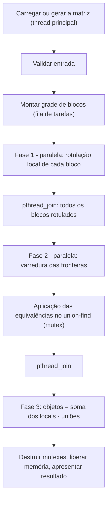
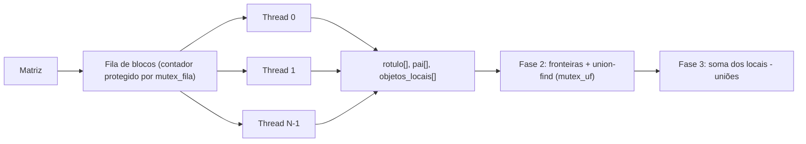
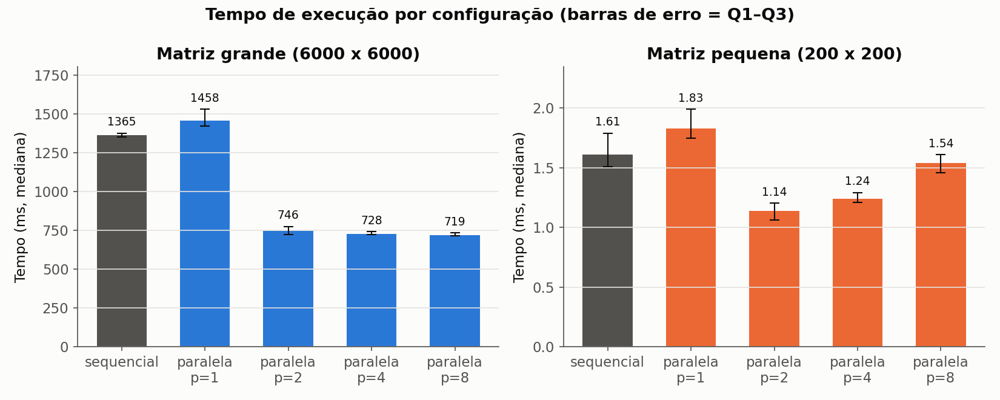
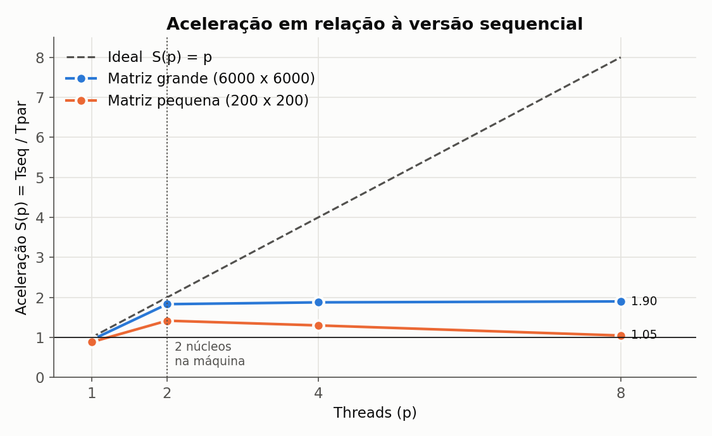
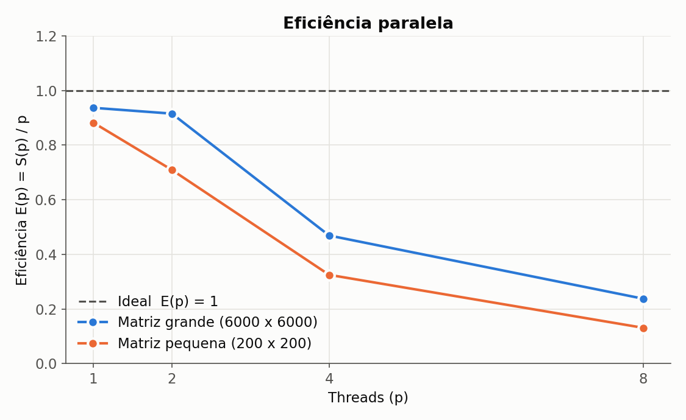

# Relatório técnico - Contagem paralela de objetos em uma matriz binária

> **Disciplina:** Sistemas Operacionais - 2026/II  
> **Professor:** Prof. Filipo Novo Mór  
> **Instituição:** Pontifícia Universidade Católica do Rio Grande do Sul - Escola Politécnica  
> **Repositório:** [https://github.com/borchardtkusler/SISOP-T1](https://github.com/borchardtkusler/SISOP-T1)  
> **Versão do relatório:** 1.0  
> **Data:** 06/10/2026

## Identificação

| Campo | Informação |
|---|---|
| Integrante 1 | Betina Borchardt Kusler |
| Matrícula do integrante 1 | 23200006-7 |
| Integrante 2 | Não se aplica |
| Matrícula do integrante 2 | Não se aplica |
| Modalidade | Individual |
| Turma | 330 |
| Estratégia paralela | Pthreads |
| Plataforma testada | macOS 26.3 (arm64, Apple M2) e Linux (x86_64) |
| Commit avaliado | 1e27bb4 |

## Resumo

Este trabalho conta os objetos de uma matriz binária, definidos como componentes conexos de células `1` sob conectividade 8. A versão sequencial percorre a matriz e, a cada célula `1` ainda não visitada, executa um *flood fill* iterativo com pilha explícita, evitando recursão profunda. A versão paralela usa Pthreads: a matriz é dividida em uma grade de blocos, distribuídos às threads por uma fila dinâmica protegida por mutex. Na primeira fase, cada thread rotula os componentes locais do bloco com um rótulo globalmente único (índice linear da semente + 1), sem coordenação. Na segunda fase, as threads examinam as fronteiras inferior e direita de cada bloco, incluindo diagonais, e registram as equivalências em uma estrutura *union-find* compartilhada, protegida por um segundo mutex. O total é a soma dos objetos locais menos o número de uniões efetivas. As duas versões produziram os resultados esperados nas cinco matrizes obrigatórias, em nove casos adicionais, em oito configurações paralelas e em 500 matrizes aleatórias comparadas com um oráculo independente (scipy). Em uma matriz 6000 × 6000, em um Apple M2 de 8 núcleos, a aceleração foi 1,74 com 2 threads, 3,31 com 4 e 4,84 com 8.

**Palavras-chave:** sistemas operacionais; paralelismo; processos; threads; conectividade 8; flood fill; componentes conexos.

## 1. Visão geral do problema

O programa recebe uma matriz binária na qual `0` representa o fundo e `1` representa o primeiro plano. Um objeto corresponde a um componente de células de valor `1` conectadas horizontalmente, verticalmente ou diagonalmente, conforme a **conectividade 8**.

O projeto contém duas implementações funcionalmente equivalentes:

1. uma versão sequencial, usada como referência de correção e de desempenho;
2. uma versão paralela baseada em **POSIX Threads (Pthreads)**.

### 1.1 Objetivos da implementação

- Contar corretamente os objetos com conectividade 8.
- Distribuir trabalho efetivo entre pelo menos duas unidades de execução.
- Reconhecer e unificar objetos que atravessam as divisões da matriz.
- Produzir resultados determinísticos e idênticos nas versões sequencial e paralela.
- Evitar condições de corrida, deadlocks, atualizações perdidas e contagens duplicadas.
- Avaliar correção, sobrecarga, escalabilidade, aceleração e eficiência.

### 1.2 Requisitos atendidos

| Requisito | Como foi atendido | Evidência no repositório |
|---|---|---|
| ANSI C C89/C90 | Todo o código compila com `-std=c89 -Wall -Wextra -pedantic -Werror` sem avisos: sem comentários `//`, declarações no início dos blocos, sem `long long`. | [`src/`](src/), [`results/verificacoes-qualidade.log`](results/verificacoes-qualidade.log) |
| Conectividade 8 | Vetores de deslocamento `VIZ_DL`/`VIZ_DC` com os 8 vizinhos; nas fronteiras, comparação com 3 vizinhos do outro lado (inclusive diagonais). | `src/comum.c` (linhas 14-15); `analisar_fronteiras` em `src/conta-objetos-paralelo.c` |
| Versão sequencial | Flood fill iterativo com pilha dinâmica e vetor de visitados. | [`src/conta-objetos-sequencial.c`](src/conta-objetos-sequencial.c) |
| Versão paralela | Pthreads em 3 fases (rotulação local, fronteiras, contagem). | [`src/conta-objetos-paralelo.c`](src/conta-objetos-paralelo.c) |
| Duas ou mais unidades concorrentes | `pthread_create` cria `N` threads por fase; ambas as fases fazem cálculo real. | `executar_fase` (linha 358); `make testes` usa 1 a 16 threads |
| Quantidade configurável de trabalhadores | Opção `-t N` (1 a 1024); grade de blocos configurável com `-b L C`. | `main` em `src/conta-objetos-paralelo.c` |
| Consolidação entre regiões | Union-find com rótulos globais únicos; objetos = locais − uniões. | `uf_unir` (linha 105), `analisar_fronteiras` (linha 252) |
| Tratamento horizontal, vertical e diagonal | Fronteira inferior compara com `(r+1, c-1..c+1)`; direita com `(r-1..r+1, c+1)`. | Exemplos 3 e 5, testes A3, A5, A6 |
| Verificação das chamadas POSIX | Retornos de `pthread_create`, `pthread_join`, `pthread_mutex_*`, `clock_gettime`, `fopen`, `malloc` verificados. | Seção 10.1 |
| Liberação dos recursos | Todas as threads recebem `join`; mutexes destruídos; memória liberada em um único ponto de saída (`fim:`). | `contar_objetos_paralelo` (linhas 526-537); Valgrind sem vazamentos |
| Compilação reproduzível | `Makefile` com alvos `all`, `testes`, `validacao`, `desempenho`, `graficos`, `clean`. | [`Makefile`](Makefile) |

## 2. Organização do repositório

```text
.
├── README.md
├── RELATORIO_TECNICO.md
├── Makefile
├── src/
│   ├── comum.h
│   ├── comum.c
│   ├── conta-objetos-sequencial.c
│   └── conta-objetos-paralelo.c
├── tests/
│   ├── obrigatorios/          (ex1.txt ... ex5.txt)
│   ├── adicionais/            (a1 ... a10)
│   ├── executa-testes.sh
│   └── validacao-aleatoria.py
├── results/
│   ├── medicoes.csv
│   ├── resumo.csv
│   ├── testes.csv
│   ├── grafico-tempo.png
│   ├── grafico-aceleracao.png
│   ├── grafico-eficiencia.png
│   ├── rastreio-ex3.txt, rastreio-ex4.txt, rastreio-ex5.txt
│   ├── testes.log, validacao-aleatoria.log, verificacoes-qualidade.log
│   ├── ambiente.txt
│   ├── mede-desempenho.sh
│   └── gera-graficos.py
└── slides/
    └── apresentacao.pdf
```

| Caminho | Finalidade |
|---|---|
| `src/comum.h`, `src/comum.c` | Código compartilhado: matriz, leitura de arquivo, gerador reproduzível, pilha dinâmica e medição de tempo. |
| `src/conta-objetos-sequencial.c` | Implementação sequencial de referência. |
| `src/conta-objetos-paralelo.c` | Implementação paralela com Pthreads. |
| `tests/obrigatorios/` | Cinco matrizes obrigatórias do enunciado (com o valor esperado no cabeçalho). |
| `tests/adicionais/` | Casos adicionais criados pela autora. |
| `tests/executa-testes.sh` | Executa todas as matrizes nas duas versões e em 8 configurações paralelas. |
| `tests/validacao-aleatoria.py` | Validação cruzada com o oráculo `scipy.ndimage.label`. |
| `results/medicoes.csv` | Dados brutos das medições de desempenho. |
| `results/resumo.csv` | Mediana, quartis, aceleração e eficiência calculados a partir dos dados brutos. |
| `results/*.png` | Gráficos gerados por `gera-graficos.py` a partir de `medicoes.csv`. |
| `results/rastreio-*.txt` | Saídas do modo `-v` mostrando a consolidação passo a passo. |
| `slides/apresentacao.pdf` | Slides utilizados na apresentação. |

## 3. Ambiente de desenvolvimento e execução

### 3.1 Hardware e software

Ambiente das medições de desempenho (registrado em [`results/ambiente.txt`](results/ambiente.txt)):

| Item | Especificação |
|---|---|
| Processador | Apple M2 (MacBook Air) |
| Núcleos físicos | 8: 4 de desempenho (P) + 4 de eficiência (E) |
| Processadores lógicos | 8 |
| Memória RAM | 8 GiB |
| Sistema operacional | macOS 26.3 (Darwin 25.3.0) |
| Arquitetura | arm64 |
| Compilador | Apple clang 17.0.0 (`cc`) |
| Padrão da linguagem | C89/C90 |
| APIs POSIX utilizadas | `pthread_create`, `pthread_join`, `pthread_mutex_init/lock/unlock/destroy`, `clock_gettime(CLOCK_MONOTONIC)` |
| Flags de compilação | `-std=c89 -Wall -Wextra -pedantic -O2 -pthread` |

O projeto também foi compilado e testado em Linux (Ubuntu 24.04, x86_64, gcc 13.3.0), onde foram executadas as verificações com Valgrind (seção 10.2). O código evita `pthread_barrier_t`, que não existe no macOS, e usa apenas APIs disponíveis nos dois sistemas.

### 3.2 Compilação

```bash
make clean
make
```

Sem `make`:

```bash
cc -std=c89 -Wall -Wextra -pedantic -O2 src/conta-objetos-sequencial.c src/comum.c -o conta-objetos-sequencial
cc -std=c89 -Wall -Wextra -pedantic -O2 -pthread src/conta-objetos-paralelo.c src/comum.c -o conta-objetos-paralelo
```

### 3.3 Execução

```bash
./conta-objetos-sequencial <arquivo> | -g <linhas> <colunas> <densidade> <semente>
./conta-objetos-paralelo [-t threads] [-b blocos_lin blocos_col] [-v] <arquivo> | -g ...
```

**Exemplo reproduzível:**

```bash
./conta-objetos-sequencial tests/obrigatorios/ex3.txt
./conta-objetos-paralelo -t 4 -b 2 2 tests/obrigatorios/ex3.txt
```

### 3.4 Formato da entrada e da saída

A matriz pode vir de um arquivo texto ou ser gerada pelo próprio programa.

- **Arquivo:** primeira linha `linhas colunas`, seguida dos valores `0`/`1`. Espaços, tabulações, vírgulas e quebras de linha são ignorados, e linhas iniciadas por `#` antes do cabeçalho são comentários. A leitura valida dimensões, caracteres e quantidade de valores.
- **Geração (`-g L C d s`):** matriz L×C em que cada célula é `1` com probabilidade `d`. Usa um gerador *xorshift* de 32 bits próprio, e não `rand()`, para que a mesma semente produza a mesma matriz em qualquer sistema. Assim, as duas versões recebem exatamente os mesmos dados nos testes de desempenho, e o script de validação replica o gerador em Python.
- **Trabalhadores:** `-t N` define o número de threads; `-b L C` define a grade de blocos (padrão `2N × 2`).

Exemplo:

```text
$ ./conta-objetos-sequencial tests/obrigatorios/ex1.txt
Versao: sequencial
Matriz: 5 x 5
Objetos: 3
Tempo(ms): 0.003

$ ./conta-objetos-paralelo -t 4 -b 2 2 tests/obrigatorios/ex1.txt
Versao: paralela (pthreads)
Matriz: 5 x 5
Threads: 4
Blocos: 2 x 2
Objetos: 3
Tempo(ms): 0.228
```

## 4. Arquitetura da solução

### 4.1 Fluxo geral



### 4.2 Estruturas de dados principais

| Estrutura | Tipo/representação | Responsabilidade | Compartilhada? | Proteção utilizada |
|---|---|---|---|---|
| Matriz de entrada | `unsigned char *dados` contínuo, linha a linha | Armazenar `0` e `1` | Sim | Não se aplica: somente leitura durante a contagem |
| Células visitadas/rótulos | Sequencial: `unsigned char visitado[L·C]`. Paralela: `int rotulo[L·C]` | Distinguir células processadas e identificar o componente | Sim (paralela) | Particionamento: cada thread escreve só nas células do próprio bloco na fase 1; na fase 2 o vetor é apenas lido |
| Pilha do flood fill | `Pilha` dinâmica de `long` (índices lineares) | Percorrer um componente sem recursão | Não: uma por thread | Não se aplica |
| Tarefas/regiões | Vetor `Bloco[]` + contador `proxima_tarefa` | Distribuir trabalho dinamicamente | Sim | `mutex_fila` |
| Equivalências de rótulos | `int pai[L·C + 1]` (union-find) + contador `unioes` | Consolidar componentes | Sim | `mutex_uf` |
| Resultados locais | `long objetos_locais[num_blocos]` | Contagem de componentes por bloco | Sim | Particionamento: cada posição é escrita por uma única thread |

## 5. Implementação sequencial

### 5.1 Algoritmo

O vetor `visitado` é alocado com `calloc`, portanto começa todo com zero. A matriz é percorrida em ordem linear. Cada célula com valor `1` e ainda não visitada é a semente de um novo objeto: o contador é incrementado e um flood fill marca todo o componente.

O flood fill é iterativo: a semente é marcada e empilhada. Enquanto a pilha não estiver vazia, desempilha-se uma célula, calculam-se linha e coluna (`idx / colunas`, `idx % colunas`) e examinam-se os 8 vizinhos, obtidos somando os deslocamentos `VIZ_DL[k]`, `VIZ_DC[k]` (NO, N, NE, O, L, SO, S, SE). Vizinhos fora da matriz são descartados. Cada vizinho `1` não visitado é **marcado no momento em que é empilhado**. Isso garante que nenhuma célula entre na pilha duas vezes e que a pilha nunca ultrapasse `L·C` elementos.

### 5.2 Pseudocódigo

```text
FUNÇÃO contar_objetos_sequencial(matriz):
    visitado[0..L·C-1] <- 0
    objetos <- 0
    PARA i DE 0 ATÉ L·C-1:
        SE matriz[i] = 1 E NÃO visitado[i]:
            objetos <- objetos + 1
            visitado[i] <- 1 ; EMPILHA(i)
            ENQUANTO pilha não vazia:
                idx <- DESEMPILHA()
                PARA cada um dos 8 vizinhos v de idx dentro da matriz:
                    SE matriz[v] = 1 E NÃO visitado[v]:
                        visitado[v] <- 1 ; EMPILHA(v)
    RETORNA objetos
```

### 5.3 Complexidade e uso de memória

| Aspecto | Análise | Justificativa |
|---|---|---|
| Complexidade de tempo | O(L·C) | Cada célula é lida uma vez pelo laço externo e, se for `1`, empilhada e desempilhada exatamente uma vez, com 8 verificações constantes. |
| Complexidade de espaço | O(L·C) | Matriz (L·C bytes) + visitados (L·C bytes) + pilha (no pior caso L·C índices). |
| Risco de recursão excessiva | Não existe | A pilha é explícita no *heap* e cresce por duplicação (`realloc`). Uma versão recursiva, em uma matriz 6000×6000 com um objeto gigante, chegaria a milhões de chamadas aninhadas e estouraria a pilha do sistema (tipicamente 8 MB). |

## 6. Implementação paralela

### 6.1 Modelo de concorrência

| Decisão | Escolha do grupo | Justificativa |
|---|---|---|
| Unidade de execução | Thread (Pthreads) | Todas as threads precisam acessar a mesma matriz e o mesmo vetor de rótulos. Com threads isso é direto, porque compartilham o espaço de endereçamento. Com processos, seria preciso memória compartilhada (`mmap`/`shm_open`) e sincronização entre processos. Threads também são mais baratas de criar. |
| Quantidade de trabalhadores | `-t N` na linha de comando (1 a 1024; padrão 2) | Permite medir escalabilidade sem recompilar. |
| Divisão do trabalho | Grade de blocos retangulares `BL × BC` (`-b`; padrão `2N × 2`) | Blocos exercitam fronteiras horizontais, verticais e o encontro de quatro blocos, como nas grades do enunciado. |
| Escalonamento | Dinâmico (fila de tarefas) | Blocos têm custos diferentes (densidade de `1`s varia). Com mais blocos que threads, uma thread que termina cedo pega o próximo bloco, e o trabalho se equilibra sozinho. |
| Comunicação | Estruturas compartilhadas em memória (`rotulo`, `pai`, `objetos_locais`, contadores) | Comunicação natural entre threads (variáveis do processo). |
| Sincronização | 2 mutexes + `pthread_join` como barreira entre fases | Mutex para cada estrutura compartilhada mutável; `join` garante que a fase 2 só lê rótulos já definitivos. |

### 6.2 Decomposição da matriz

Os limites do bloco `(i, j)` são calculados por divisão inteira:

```text
l0 = i·L / BL      l1 = (i+1)·L / BL
c0 = j·C / BC      c1 = (j+1)·C / BC
```

Isso distribui as sobras automaticamente: quando `L` não é múltiplo de `BL`, os blocos diferem em no máximo uma linha. Por exemplo, 9 linhas em 2 faixas geram faixas de 4 e 5 linhas. Se forem pedidas mais faixas do que linhas ou colunas existentes, o programa reduz a grade (`BL ≤ L`, `BC ≤ C`), então nenhum bloco fica vazio. A quantidade de blocos pode ser maior que a de threads (caso padrão: `4N` blocos) ou menor. Threads que não conseguem tarefa terminam imediatamente.



### 6.3 Paralelismo efetivo

O cálculo pesado, o flood fill de todas as células, é feito **simultaneamente** pelas threads na fase 1, cada uma em blocos diferentes. As threads não esperam umas pelas outras nessa fase: a única interação é retirar o próximo bloco da fila, o que custa alguns nanossegundos por bloco. A fase 2 também é paralela: a varredura das fronteiras só lê dados e é feita sem trava. Só a aplicação das uniões é serializada, e seu custo é proporcional ao perímetro dos blocos, não à área. A evidência de paralelismo real é a aceleração de 3,31 com 4 threads e de 4,84 com 8 threads na matriz grande (seção 9).

| Etapa | Sequencial ou paralela? | Unidade responsável | Motivo |
|---|---|---|---|
| Leitura/geração da matriz | Sequencial | Thread principal | E/S de arquivo é sequencial; fica fora da medição de tempo. |
| Particionamento | Sequencial | Thread principal | O(número de blocos): custo desprezível. |
| Identificação local | **Paralela** | Threads trabalhadoras | Blocos são independentes: domina o tempo total. |
| Análise das fronteiras | **Paralela** | Threads trabalhadoras | Leitura de `rotulo`, que não muda mais. |
| Consolidação | Serializada por mutex | Threads trabalhadoras | Union-find compartilhado; um bloqueio por bloco. |
| Contagem final | Sequencial | Thread principal | Soma de `num_blocos` valores e uma subtração. |

### 6.4 Sincronização, comunicação e regiões críticas

| Recurso/dado | Risco concorrente | Mecanismo usado | Escopo da proteção | Justificativa |
|---|---|---|---|---|
| `proxima_tarefa` (fila) | Duas threads lerem o mesmo valor e processarem o mesmo bloco, ou pularem um bloco (atualização perdida) | `mutex_fila` | Só a leitura e o incremento do contador (`pegar_tarefa`) | É o mesmo problema do `x = x + 1` dos slides; a região crítica mínima reduz a contenção. |
| `pai[]` e `unioes` (union-find) | Duas uniões simultâneas sobrescreverem `pai[]` e perderem uma ligação; `unioes` contada errado | `mutex_uf` | A aplicação de todas as equivalências de um bloco (um bloqueio por bloco, não por par) | `uf_encontrar` também escreve (compressão de caminho), então nem as consultas podem ser concorrentes. |
| `ctx->erro` | Leitura e escrita simultâneas | `mutex_fila` | Leitura em `pegar_tarefa`; escrita em `sinalizar_erro` | Permite que todas as threads parem após uma falha. |
| `rotulo[]` | Duas threads escreverem na mesma célula | Particionamento + `pthread_join` | Fase 1: cada thread só escreve nas células do próprio bloco (o flood fill não sai do bloco). Fase 2: só leitura | Dispensa trava no caminho mais quente do programa. O `join` entre as fases garante que as escritas da fase 1 estão visíveis na fase 2. |
| `objetos_locais[]` | Escrita concorrente | Particionamento | Cada posição é escrita por uma única thread | O bloco `b` é entregue a exatamente uma thread. |
| Rótulos novos | Duas threads criarem o mesmo rótulo | Rótulo = índice linear da semente + 1 | — | Cada célula tem índice único, então rótulos de threads diferentes nunca colidem, **sem nenhuma comunicação**. |

**Ausência de deadlock:** nenhuma thread segura dois mutexes ao mesmo tempo. `mutex_fila` e `mutex_uf` são sempre adquiridos e liberados isoladamente, sem chamadas bloqueantes dentro das regiões críticas. Sem retenção e espera, não pode haver ciclo de espera. `pthread_join` só é chamado pela thread principal, que não segura nenhum mutex nesse momento.

## 7. Consolidação dos componentes

Somar as contagens locais estaria errado: no exemplo 3 com grade 2 × 2, a soma dos componentes locais é **8**, mas a resposta correta é **5**. O objeto central 2 × 2 ocupa os quatro blocos e seria contado quatro vezes.

### 7.1 Identificação local

Cada componente local recebe como rótulo o **índice linear da sua semente + 1** (`rot = idx + 1`), isto é, da primeira célula do componente encontrada na varredura do bloco. O valor `0` fica reservado para o fundo. Como índices lineares são únicos na matriz inteira, rótulos criados por threads diferentes em blocos diferentes já são distintos, sem contador global e sem trava. A thread que cria o rótulo também inicializa `pai[rot] = rot`: cada componente local começa como um conjunto próprio no union-find.

### 7.2 Verificação das fronteiras

Cada bloco é responsável pela sua **fronteira inferior** e pela sua **fronteira direita**. Assim, cada fronteira da grade é examinada exatamente uma vez. Pares em que alguma das células é fundo, ou em que os rótulos são iguais, são ignorados.

| Situação | Pares de células verificados | Como a equivalência é registrada |
|---|---|---|
| Fronteira horizontal (entre bloco de cima e de baixo) | Para cada `(r, c)` na última linha do bloco: `(r+1, c)` | Par `(min, max)` dos rótulos no buffer local da thread |
| Fronteira vertical (entre bloco da esquerda e da direita) | Para cada `(r, c)` na última coluna do bloco: `(r, c+1)` | Idem |
| Conexão diagonal | Fronteira inferior: `(r+1, c-1)` e `(r+1, c+1)`. Fronteira direita: `(r-1, c+1)` e `(r+1, c+1)` | Idem |
| Encontro de quatro blocos | Na célula do canto `(r, c)`, a diagonal `(r+1, c+1)` pertence ao bloco diagonal, e `(r, c+1)`/`(r+1, c)` formam a antidiagonal. Como a varredura da fronteira inferior percorre a linha inteira e olha `c-1` e `c+1`, as duas diagonais do canto são cobertas mesmo quando atravessam para o bloco da diagonal | Idem (ex.: união 28 ~ 37 no exemplo 3) |

Pares repetidos consecutivos, muito comuns quando um objeto atravessa a fronteira em várias células, são descartados ainda no buffer local.

### 7.3 Unificação e contagem global

É usada a estrutura **union-find** (conjuntos disjuntos). `uf_encontrar` segue `pai[]` até a raiz, com compressão de caminho por *halving*. `uf_unir(a, b)` liga a raiz maior à menor. Escolher sempre o menor rótulo como representante torna a estrutura final independente da ordem em que as threads fazem as uniões.

A consolidação ocorre na fase 2, depois do `pthread_join` da fase 1. Cada thread: (1) varre as fronteiras do bloco sem trava (apenas lê `rotulo`); (2) trava `mutex_uf` **uma vez**; (3) aplica todas as equivalências do bloco; (4) destrava.

A contagem final vem de uma propriedade simples: cada união **efetiva**, entre raízes diferentes, junta dois conjuntos em um e reduz o número de objetos em exatamente 1. Uniões redundantes retornam 0 e não são contadas. Logo:

```text
objetos = Σ objetos_locais[b]  −  unioes
```

Essa fórmula dispensa uma varredura final da matriz.

### 7.4 Exemplo rastreável

Exemplo 3 (8 × 8, grade 2 × 2, 2 threads). Saída completa em [`results/rastreio-ex3.txt`](results/rastreio-ex3.txt) (`./conta-objetos-paralelo -t 2 -b 2 2 -v tests/obrigatorios/ex3.txt`):

```text
Fase 1 - rotulos locais (rotulo = indice da semente + 1):
     1   1   .   .   |   .   .   .   .
     1   .   .   .   |   .   .   .   .
     .   .   .   .   |   .   .  23   .
     .   .   .  28   |  29   .  23   .
     ----------------+----------------
     .   .   .  36   |  37   .   .   .
     .   .   .   .   |   .   .   .   .
     .   .  51   .   |   .   .   .  56
     .   .  51   .   |   .   .  56  56
Objetos locais por bloco: 2 2 2 2  (soma = 8)

Fase 2 - unioes nas fronteiras:
  [bloco 0] une rotulo 28 com rotulo 36   (vertical)
  [bloco 0] une rotulo 28 com rotulo 37   (diagonal no encontro dos 4 blocos)
  [bloco 0] une rotulo 28 com rotulo 29   (horizontal)

Objetos = 8 (locais) - 3 (unioes) = 5
```

(As linhas separadoras foram acrescentadas aqui para mostrar os blocos.)

| Região | Rótulo local | Células de fronteira relevantes | Equivalência global |
|---|---|---|---|
| Bloco 0 (sup. esq.) | 1 | nenhuma (não toca fronteira) | 1 |
| Bloco 0 (sup. esq.) | 28 | (3,3): vizinha de (4,3), (4,4) e (3,4) | 28 |
| Bloco 1 (sup. dir.) | 29 | (3,4): vizinha de (3,3) | 28 |
| Bloco 1 (sup. dir.) | 23 | nenhuma | 23 |
| Bloco 2 (inf. esq.) | 36 | (4,3): vizinha de (3,3) | 28 |
| Bloco 2 (inf. esq.) | 51 | nenhuma | 51 |
| Bloco 3 (inf. dir.) | 37 | (4,4): vizinha diagonal de (3,3) | 28 |
| Bloco 3 (inf. dir.) | 56 | nenhuma | 56 |

Resultado: 5 representantes distintos, {1, 23, 28, 51, 56}. Os rastreios dos exemplos 4 (11 − 5 = 6) e 5 (13 − 6 = 7) estão em [`results/rastreio-ex4.txt`](results/rastreio-ex4.txt) e [`results/rastreio-ex5.txt`](results/rastreio-ex5.txt).

## 8. Correção e testes funcionais

### 8.1 Procedimento de validação

A validação foi automatizada em três níveis:

1. **`tests/executa-testes.sh`** (`make testes`): cada arquivo traz o valor esperado no cabeçalho (`# ... | esperado: N`). O script executa a versão sequencial e a paralela em 8 configurações — (threads, blocos) = (1, 1×1), (2, 1×2), (2, 2×2), (4, 2×2), (4, 3×3), (3, 1×5), (8, 4×4), (16, 12×12) — e depois repete a configuração (4, 3×3) 20 vezes para verificar o determinismo. Resultado: **406 execuções, 0 falhas** ([`results/testes.log`](results/testes.log), [`results/testes.csv`](results/testes.csv)).
2. **`tests/validacao-aleatoria.py`** (`make validacao`): 500 matrizes aleatórias com tamanho (1 a 60), densidade, semente, threads (1 a 8) e grade (1 a 12 × 1 a 12) sorteados. Cada caso é comparado com `scipy.ndimage.label` usando estrutura 3 × 3, uma implementação **independente** da nossa. Resultado: **500 casos, 0 falhas** ([`results/validacao-aleatoria.log`](results/validacao-aleatoria.log)).
3. **Matriz de desempenho:** em todas as 100 execuções registradas das medições, a versão paralela coincidiu com a sequencial (coluna `resultado_correto` de `medicoes.csv`).

Os valores esperados dos testes adicionais também foram calculados com o scipy, e não à mão.

### 8.2 Matrizes obrigatórias

| Exemplo | Dimensões | Objetos esperados | Resultado sequencial | Resultado paralelo | Trabalhadores | Situação | Evidência |
|---:|---:|---:|---:|---:|---:|---|---|
| 1 | 5 x 5 | 3 | 3 | 3 | 1, 2, 3, 4, 8, 16 | Aprovado | [`testes.csv`](results/testes.csv) |
| 2 | 6 x 8 | 4 | 4 | 4 | 1, 2, 3, 4, 8, 16 | Aprovado | [`testes.csv`](results/testes.csv) |
| 3 | 8 x 8 | 5 | 5 | 5 | 1, 2, 3, 4, 8, 16 | Aprovado | [`rastreio-ex3.txt`](results/rastreio-ex3.txt) |
| 4 | 9 x 12 | 6 | 6 | 6 | 1, 2, 3, 4, 8, 16 | Aprovado | [`rastreio-ex4.txt`](results/rastreio-ex4.txt) |
| 5 | 12 x 12 | 7 | 7 | 7 | 1, 2, 3, 4, 8, 16 | Aprovado | [`rastreio-ex5.txt`](results/rastreio-ex5.txt) |

As grades ilustradas no enunciado (2 × 2 para os exemplos 1-3 e 3 × 3 para os exemplos 4-5) estão entre as configurações testadas.

### 8.3 Casos de teste adicionais

| ID | Dimensões | Característica avaliada | Resultado de referência | Configurações paralelas | Resultado obtido | Situação |
|---|---:|---|---:|---|---:|---|
| A1 | 7 x 9 | Matriz vazia (somente zeros) | 0 | 8 configs + 20 repetições | 0 | Aprovado |
| A2 | 13 x 13 | Um único objeto em serpentina atravessando todos os blocos | 1 | 8 configs + 20 repetições | 1 | Aprovado |
| A3 | 10 x 10 | Tabuleiro de xadrez: conexões **somente** diagonais | 1 | 8 configs + 20 repetições | 1 | Aprovado |
| A4 | 6000 x 6000 | Matriz grande do desempenho (densidade 0,45, semente 42) | 263877 | 1, 2, 4, 8 threads × 10 execuções | 263877 | Aprovado |
| A5 | 10 x 10 | "X" de diagonais cruzando o encontro de quatro blocos | 1 | 8 configs + 20 repetições | 1 | Aprovado |
| A6 | 6 x 6 | Par antidiagonal isolado exatamente no canto de 4 blocos | 4 | 8 configs + 20 repetições | 4 | Aprovado |
| A7 | 1 x 25 | Matriz com uma única linha | 7 | 8 configs + 20 repetições | 7 | Aprovado |
| A8 | 25 x 1 | Matriz com uma única coluna | 7 | 8 configs + 20 repetições | 7 | Aprovado |
| A9 | 9 x 11 | Todas as células iguais a 1 | 1 | 8 configs + 20 repetições | 1 | Aprovado |
| A10 | 40 x 40 | Aleatória, densidade 0,45 | 23 | 8 configs + 20 repetições | 23 | Aprovado |
| A11 | 200 x 200 | Matriz pequena do desempenho | 278 | 1, 2, 4, 8 threads × 10 execuções | 278 | Aprovado |

O A6 foi desenhado para o caso mais sutil: duas células ligadas **apenas** pela antidiagonal do canto onde quatro blocos se encontram, cada uma em um bloco diferente. A7 e A8 testam a redução automática da grade quando há mais faixas do que linhas ou colunas.

### 8.4 Repetibilidade e determinismo

| Teste | Repetições | Configurações | Resultados idênticos? | Observações |
|---|---:|---|---|---|
| 14 matrizes (obrigatórias + adicionais) | 20 cada (280) | 4 threads, 3 × 3 blocos | Sim | 0 divergências. |
| Matriz grande 6000 × 6000 | 10 por configuração | 1, 2, 4, 8 threads | Sim | Sempre 263877. |
| 500 matrizes aleatórias | 1 cada | Threads e grade sorteadas | Sim | Iguais ao scipy e à versão sequencial. |

A **ordem** das uniões varia entre execuções (depende de qual thread chega primeiro ao mutex, como mostra o modo `-v`), mas o **resultado** não. O conjunto de pares examinados é sempre o mesmo, e o número de uniões efetivas necessárias para juntar um conjunto de componentes independe da ordem.

## 9. Avaliação de desempenho

### 9.1 Metodologia experimental

| Parâmetro | Valor adotado |
|---|---|
| Matriz ou conjunto de matrizes | "grande": 6000 × 6000 (36 milhões de células), densidade 0,45, semente 42 (263877 objetos). "pequena": 200 × 200, densidade 0,45, semente 42 (278 objetos). Densidade 0,45 fica acima do limiar de percolação da conectividade 8 (≈ 0,41), o que produz um objeto gigante atravessando todos os blocos e milhares de objetos pequenos: um caso difícil para a consolidação. |
| Mesmos dados em todas as versões? | Sim. Geradas pela opção `-g` com a mesma semente e o mesmo gerador determinístico. |
| Relógio/API de medição | `clock_gettime(CLOCK_MONOTONIC, ...)` |
| Trecho medido | Somente a contagem: alocação das estruturas, criação/`join` das threads, fases 1-3 e liberação. **Excluídos**: geração/leitura da matriz e impressão. |
| Aquecimentos descartados | 1 execução por configuração |
| Repetições por configuração | 10, **intercaladas** (em cada rodada todas as configurações rodam uma vez), para que o ruído momentâneo da máquina afete todas de forma parecida |
| Medida representativa | Mediana |
| Critério para dispersão | Intervalo interquartil (IQR = Q3 − Q1); mínimo e máximo em `resumo.csv` |
| Carga do sistema durante os testes | Notebook com os demais aplicativos fechados. A dispersão foi baixa: na matriz grande, o IQR ficou abaixo de 5 % da mediana em todas as configurações). |
| Flags de otimização | `-O2` |

As medições brutas estão disponíveis em [`results/medicoes.csv`](results/medicoes.csv), e o resumo em [`results/resumo.csv`](results/resumo.csv). Para reproduzir: `make desempenho && make graficos`.

### 9.2 Métricas

A aceleração para `p` trabalhadores é calculada por:

$$
S(p) = \frac{T_{sequencial}}{T_{paralelo}(p)}
$$

A eficiência paralela é calculada por:

$$
E(p) = \frac{S(p)}{p}
$$

### 9.3 Resultados consolidados

**Matriz grande (6000 × 6000):**

| Versão | Trabalhadores (`p`) | Tempo representativo (ms) | Dispersão - IQR (ms) | Aceleração `S(p)` | Eficiência `E(p)` | Resultado correto? |
|---|---:|---:|---:|---:|---:|---|
| Sequencial | 1 | 728,4 | 3,1 | 1,00 | 1,00 | Sim |
| Paralela | 1 | 797,5 | 2,6 | 0,91 | 0,91 | Sim |
| Paralela | 2 | 417,4 | 4,6 | 1,74 | 0,87 | Sim |
| Paralela | 4 | 220,0 | 1,4 | **3,31** | **0,83** | Sim |
| Paralela | 8 | 150,4 | 7,3 | **4,84** | 0,61 | Sim |

**Matriz pequena (200 × 200):**

| Versão | Trabalhadores (`p`) | Tempo representativo (ms) | Dispersão - IQR (ms) | Aceleração `S(p)` | Eficiência `E(p)` | Resultado correto? |
|---|---:|---:|---:|---:|---:|---|
| Sequencial | 1 | 0,900 | 0,016 | 1,00 | 1,00 | Sim |
| Paralela | 1 | 1,020 | 0,028 | 0,88 | 0,88 | Sim |
| Paralela | 2 | 0,593 | 0,008 | 1,52 | 0,76 | Sim |
| Paralela | 4 | 0,427 | 0,013 | 2,11 | 0,53 | Sim |
| Paralela | 8 | 0,438 | 0,040 | 2,05 | 0,26 | Sim |

### 9.4 Dados brutos das repetições

**Matriz grande (6000 × 6000), tempos em ms:**

| Versão | p | R1 | R2 | R3 | R4 | R5 | R6 | R7 | R8 | R9 | R10 | Mediana |
|---|---:|---:|---:|---:|---:|---:|---:|---:|---:|---:|---:|---:|
| Sequencial | 1 | 724,1 | 728,5 | 727,1 | 725,1 | 725,6 | 728,4 | 730,8 | 728,7 | 729,2 | 730,8 | 728,4 |
| Paralela | 1 | 790,5 | 797,8 | 804,2 | 797,5 | 797,4 | 805,9 | 794,6 | 792,5 | 797,5 | 797,8 | 797,5 |
| Paralela | 2 | 417,8 | 412,6 | 422,6 | 417,1 | 421,4 | 415,3 | 415,4 | 438,9 | 417,4 | 417,4 | 417,4 |
| Paralela | 4 | 221,2 | 219,6 | 220,6 | 224,3 | 229,0 | 220,2 | 219,6 | 218,5 | 219,8 | 219,8 | 220,0 |
| Paralela | 8 | 153,6 | 173,2 | 151,8 | 154,0 | 145,1 | 147,5 | 161,7 | 144,8 | 149,0 | 146,2 | 150,4 |

**Matriz pequena (200 × 200), tempos em ms:**

| Versão | p | R1 | R2 | R3 | R4 | R5 | R6 | R7 | R8 | R9 | R10 | Mediana |
|---|---:|---:|---:|---:|---:|---:|---:|---:|---:|---:|---:|---:|
| Sequencial | 1 | 0,854 | 0,896 | 0,892 | 0,899 | 0,907 | 0,901 | 0,888 | 0,909 | 0,909 | 0,915 | 0,900 |
| Paralela | 1 | 0,984 | 1,024 | 1,011 | 1,036 | 1,042 | 1,103 | 1,011 | 1,016 | 1,016 | 1,045 | 1,020 |
| Paralela | 2 | 0,591 | 0,575 | 0,583 | 0,600 | 0,593 | 0,594 | 0,639 | 0,584 | 0,593 | 0,592 | 0,593 |
| Paralela | 4 | 0,426 | 0,411 | 0,432 | 0,413 | 0,457 | 0,440 | 0,471 | 0,427 | 0,425 | 0,428 | 0,427 |
| Paralela | 8 | 0,381 | 0,418 | 0,416 | 0,470 | 0,412 | 0,423 | 0,458 | 0,453 | 0,453 | 0,493 | 0,438 |

### 9.5 Gráfico de tempo de execução



**Figura 1 -** Tempo de execução da versão sequencial e das configurações paralelas. Barras de erro representam o intervalo interquartil (Q1 a Q3). Os painéis têm escalas diferentes porque os tempos diferem em três ordens de grandeza. Fonte: elaborado pela autora.

### 9.6 Gráfico de aceleração



**Figura 2 -** Aceleração observada em função da quantidade de trabalhadores. A linha ideal corresponde a `S(p) = p`; a linha pontilhada marca os 8 núcleos da máquina (4 de desempenho e 4 de eficiência). Fonte: elaborado pela autora.

### 9.7 Gráfico de eficiência



**Figura 3 -** Eficiência paralela em função da quantidade de trabalhadores. Fonte: elaborado pela autora.

### 9.8 Análise dos resultados

**Ganho em relação à versão sequencial.** Na matriz grande, o tempo caiu de 728 ms (sequencial) para 417 ms com 2 threads, 220 ms com 4 e 150 ms com 8. As acelerações foram 1,74, 3,31 e 4,84. O tempo diminui a cada aumento de threads, o que confirma que a fase 1, que domina o custo, é executada de fato em paralelo.

**Por que a versão paralela com 1 thread é 9 % mais lenta que a sequencial (S = 0,91).** Ela faz mais trabalho que a sequencial:

- usa `int rotulo[]` (4 bytes/célula, 144 MB) em vez de `unsigned char visitado[]` (1 byte/célula, 36 MB), o que quadruplica o tráfego de memória;
- aloca `pai[]` (mais 144 MB), cujas páginas causam *page faults* na primeira escrita;
- executa a fase 2 (fronteiras e union-find), que a sequencial não precisa;
- cria e espera threads duas vezes e trava mutexes a cada bloco.

Essa sobrecarga é o custo de tornar o problema decomponível. A comparação com a versão sequencial otimizada é a mais honesta, e é a usada no cálculo de `S(p)`.

**Escalabilidade até 4 threads.** A eficiência cai pouco: 0,91 com 1 thread, 0,87 com 2 e 0,83 com 4. Quase toda a distância para o ideal já está presente com 1 thread, ou seja, vem da sobrecarga fixa do algoritmo paralelo, e não de contenção entre threads. Comparando a versão paralela consigo mesma, de 1 para 4 threads o tempo cai 3,62 vezes (797,5 / 220,0), perto de 4. Isso é coerente com o projeto: a fase 1 não usa nenhuma trava nos dados, e a única região crítica frequente é a retirada de um bloco da fila. O que impede o ganho ideal é a parte que não se divide: os *page faults* da alocação de 288 MB, tratados pelo kernel, a disputa dos núcleos pela mesma largura de banda de memória e a região crítica do union-find.

**Por que S(8) = 4,84 e não 8.** O Apple M2 tem núcleos heterogêneos: 4 de desempenho (P) e 4 de eficiência (E), estes mais lentos. Com 4 threads, o sistema operacional pode manter todas nos núcleos P. Com 8, metade das threads roda em núcleos E, de modo que a capacidade total de cálculo fica bem abaixo de "8 núcleos P". A eficiência de 0,61 reflete essa limitação do hardware, e não uma falha do algoritmo. Ainda assim os núcleos E contribuem: o tempo caiu de 220 ms para 150 ms. Aqui a **fila dinâmica** é importante. Com uma divisão estática (um bloco fixo por thread), o tempo total seria ditado pelas threads nos núcleos lentos. Com a fila e 32 blocos (grade padrão `2p × 2`), os núcleos rápidos simplesmente retiram mais blocos, e o trabalho se ajusta à velocidade de cada núcleo. A configuração com 8 threads também teve a maior dispersão (IQR de 7,3 ms), compatível com a variação de quais threads o sistema coloca em cada tipo de núcleo.

**Matriz pequena.** Com 200 × 200 (40 mil células), a contagem sequencial leva 0,9 ms. A versão paralela ainda ganha com 2 threads (S = 1,52) e com 4 (S = 2,11), mas com 8 não há ganho adicional (S = 2,05; 0,438 ms contra 0,427 ms). Cada execução com 8 threads cria e espera 16 threads (2 fases × 8), e esse custo fixo passa a competir com um cálculo de menos de meio milissegundo. A eficiência cai para 0,26. Como alerta o enunciado, matrizes pequenas servem para validar correção, não para medir ganho.

**Custo da consolidação.** A fase 2 trabalha só sobre as fronteiras: com uma grade `BL × BC`, examina cerca de `(BL−1)·C + (BC−1)·L` células, frente às `L·C` da fase 1. Para 6000 × 6000 com 8 threads (grade 16 × 2), são cerca de 96 mil células de fronteira contra 36 milhões no total (menos de 0,3 %). Travar o mutex uma vez por bloco, e não por par, mantém a contenção desprezível.

**Trechos que permanecem sequenciais.** Geração/leitura da matriz (fora da medição), alocação das estruturas, montagem da grade (O(blocos)), a região crítica do union-find e a fase 3 (O(blocos)).

## 10. Tratamento de erros e qualidade do código

### 10.1 Chamadas e recursos POSIX

| Chamada/recurso | Erro verificado? | Ação em caso de falha | Liberação/finalização |
|---|---|---|---|
| `pthread_create` | Sim | Mensagem com `strerror(rc)`, sinaliza erro para as threads já criadas pararem, faz `join` somente nas criadas e retorna erro | `pthread_join` de todas as threads criadas |
| `pthread_join` | Sim | Mensagem e marca erro | — |
| `pthread_mutex_init` | Sim | Mensagem e aborta a contagem; só destrói os mutexes que foram inicializados (flags `mutex_*_ok`) | `pthread_mutex_destroy` (retorno verificado) |
| `pthread_mutex_lock` / `unlock` | Sim | Mensagem; a thread sinaliza erro e para | — |
| `fork` | Não se aplica | — | — |
| `clock_gettime` | Sim | `perror` | — |
| `fopen` / leitura | Sim | `perror`; validação de cabeçalho, caracteres e quantidade de valores | `fclose` em todos os caminhos |
| Memória alocada (`malloc`, `calloc`, `realloc`) | Sim | Mensagem "memória insuficiente"; a thread sinaliza erro | `free` em um único ponto de saída (`goto fim`), padrão comum em C para não duplicar limpeza |

Observação: as funções `pthread_*` não usam `errno`; retornam o código de erro, que é impresso com `strerror(rc)`.

### 10.2 Compilação e análise

| Verificação | Comando/ferramenta | Resultado |
|---|---|---|
| Compilação C89/C90 | `make` (clang no macOS, gcc no Linux); `make OPT="-O2 -Werror"` no Linux | Sem erros |
| Avisos do compilador | `-Wall -Wextra -pedantic` | Nenhum aviso |
| Vazamentos de memória | Valgrind memcheck (`--leak-check=full`), ambas as versões, em Linux (o Valgrind não está disponível para macOS em arm64) | "All heap blocks were freed -- no leaks are possible"; 0 erros |
| Condições de corrida | ThreadSanitizer (`-fsanitize=thread`), em macOS (clang) e Linux (gcc): 800 × 800 com 8 threads e 16 × 16 blocos; no Linux também as 5 obrigatórias. Valgrind Helgrind (Linux): 200 × 200, 4 threads | 0 avisos (TSan); 0 erros (Helgrind) |

Detalhes das verificações feitas em Linux em [`results/verificacoes-qualidade.log`](results/verificacoes-qualidade.log).

Durante o desenvolvimento, o AddressSanitizer revelou um erro: vizinhos de fundo (rótulo 0) eram registrados como equivalências, e o union-find acessava `pai[0]`, nunca inicializado. A correção foi ignorar pares com rótulo 0 em `registrar_par`.

### 10.3 Separação de responsabilidades

- **Entrada, geração e utilitários** (`comum.c`/`comum.h`): leitura e validação de arquivo, gerador reproduzível, pilha dinâmica, relógio. As duas versões usam o mesmo código, o que garante dados e medição idênticos.
- **Processamento sequencial** (`contar_objetos_sequencial`, `flood_fill`).
- **Processamento paralelo**: rotulação (`rotular_bloco`), fronteiras (`analisar_fronteiras`, `registrar_par`), consolidação (`uf_encontrar`, `uf_unir`).
- **Sincronização**: concentrada em `pegar_tarefa`, `sinalizar_erro`, `executar_fase` e na região crítica de `analisar_fronteiras`.
- **Medição**: somente em `main`, em volta da chamada de contagem.
- **Testes e experimentos**: scripts separados em `tests/` e `results/`.

## 11. Limitações e decisões de projeto

| Limitação ou decisão | Impacto | Alternativa considerada | Motivo da escolha |
|---|---|---|---|
| Threads em vez de processos | Menor isolamento: um erro derruba o programa todo | Processos com `fork` + memória compartilhada (`mmap`) + semáforos POSIX | Rótulos e union-find precisam ser compartilhados; com threads isso é natural e mais barato. |
| Rótulo = índice linear + 1 (tipo `int`) | Limita a matriz a ~2,1 bilhões de células; `pai[]` tem o tamanho da matriz (4 bytes/célula) | Contador de rótulos por bloco com prefixo somado após a fase 1 (economiza memória) | Rótulos únicos sem nenhuma coordenação e sem etapa extra. Memória suficiente para os casos do trabalho. |
| Union-find com um mutex global | Uniões serializadas | Mutex por raiz ou operações atômicas (*compare-and-swap*) | O custo da fase 2 é proporcional ao perímetro dos blocos (menos de 0,3 % das células); operações atômicas não fazem parte do C89. |
| `pthread_join` como barreira (threads recriadas por fase) | ~dezenas de µs a mais por fase | `pthread_barrier_t`, ou barreira com mutex + variável de condição | `pthread_barrier_t` não existe no macOS. O `join` é simples, portável e seu custo é desprezível na matriz grande. |
| Grade padrão `2p × 2` | Mais blocos que threads, com mais fronteiras | 1 bloco por thread (faixas) | Balanceamento dinâmico sem aumentar muito o perímetro. Configurável com `-b`. |
| Medições em processador com núcleos heterogêneos (4 P + 4 E) | A aceleração com 8 threads não pode ser comparada diretamente com o ideal `S(p) = p` | Medir em máquina com 8 núcleos iguais | Hardware disponível; a análise (seção 9.8) considera essa característica. |

## 12. Conclusão

Os objetivos foram alcançados. As versões sequencial e paralela contam corretamente objetos com conectividade 8, produzindo os valores esperados nas cinco matrizes obrigatórias, em nove casos adicionais, em oito configurações de threads e blocos, em 280 repetições de determinismo e em 500 matrizes aleatórias comparadas com uma implementação independente. ThreadSanitizer, Helgrind e Valgrind não apontaram condições de corrida nem erros de memória.

No desempenho, na matriz 6000 × 6000 em um Apple M2, a versão paralela obteve aceleração de 1,74 com 2 threads, 3,31 com 4 (eficiência 0,83) e 4,84 com 8. A queda de eficiência com 8 threads se explica pelos núcleos de eficiência do processador, mais lentos que os de desempenho. Na matriz 200 × 200, passar de 4 para 8 threads não trouxe ganho, porque o custo fixo de criar threads compete com um cálculo de menos de um milissegundo, o que ilustra por que matrizes pequenas não servem para avaliar desempenho.

O principal aprendizado é que paralelizar exige tornar o problema decomponível. O flood fill paralelo em si é simples; o essencial está em (1) escolher rótulos que não colidem sem comunicação, (2) restringir as escritas de cada thread à sua região, para dispensar travas no caminho mais custoso, e (3) concentrar a sincronização em uma etapa pequena, a consolidação das fronteiras. Uma melhoria futura realista seria compactar os rótulos após a fase 1, reduzindo o vetor `pai[]` ao número de componentes locais, o que diminuiria a memória e a sobrecarga observada com 1 thread.

## 13. Vídeo de apresentação

| Campo | Informação |
|---|---|
| Plataforma | YouTube |
| Link privado ou não listado | https://youtu.be/e17jc-374nE?is=cAjXPMiXK9a0TT8g |
| Duração | 07:45 |
| Privacidade | Não listado |
| Senha, se aplicável | Não se aplica |
| Data da última verificação do acesso | 06/10/2026 |

> **Importante:** o vídeo deve permanecer acessível ao professor durante todo o período de avaliação. Teste o link em uma janela anônima antes da entrega.

### 13.1 Conteúdo do vídeo

- [x] Problema e estratégia escolhida.
- [x] Implementação sequencial e referência de correção.
- [x] Decomposição, processos/threads e sincronização.
- [x] Consolidação de objetos que atravessam regiões (sugestão: demonstrar `-v` no exemplo 3).
- [x] Demonstração executável.
- [x] Testes obrigatórios e adicionais (`make testes`).
- [x] Resultados de desempenho.
- [x] Conclusões.

## 14. Contribuições dos integrantes

| Atividade | Integrante 1 | Evidência/observação |
|---|---|---|
| Todas as atividades (solução sequencial e paralela, sincronização, consolidação, testes, medições, documentação e apresentação) | 100% | Trabalho individual. O código, os scripts e a redação inicial do relatório foram gerados com apoio de ferramenta de IA, identificada na seção 15. Compilação, execução dos testes, verificação com o ThreadSanitizer, medições de desempenho em máquina própria (Apple M2), revisão do material e publicação foram realizadas pela autora. Histórico em https://github.com/borchardtkusler/SISOP-T1/commits/main |

Declaro compreender integralmente o código, as estruturas de dados, a divisão do trabalho, a sincronização, a comunicação, a consolidação e os resultados apresentados.

## 15. Ferramentas, bibliotecas, referências e códigos externos

| Recurso | Finalidade | Origem/link | Licença, quando aplicável | Partes do projeto afetadas |
|---|---|---|---|---|
| POSIX Threads | Criação de threads e mutexes | Biblioteca do sistema (`-pthread`) | — | `src/conta-objetos-paralelo.c` |
| SciPy (`scipy.ndimage.label`) | Oráculo independente para validar contagens | https://scipy.org | BSD-3-Clause | `tests/validacao-aleatoria.py`, valores esperados de `tests/adicionais/` |
| NumPy | Manipulação das matrizes nos testes | https://numpy.org | BSD-3-Clause | `tests/validacao-aleatoria.py` |
| Matplotlib | Gráficos de desempenho | https://matplotlib.org | Licença Matplotlib (PSF-like) | `results/gera-graficos.py` |
| Valgrind (memcheck, helgrind) | Vazamentos e erros de sincronização | https://valgrind.org | GPL-2.0 | Verificação (seção 10.2) |
| ThreadSanitizer / AddressSanitizer | Detecção de condições de corrida e de erros de memória | gcc (Linux) e Apple clang (macOS) | GPL-3.0 (gcc); Apache-2.0 com exceção LLVM (clang) | Verificação (seção 10.2) |
| Union-find (conjuntos disjuntos) | Algoritmo clássico de consolidação | Cormen et al., *Algoritmos: Teoria e Prática*, cap. "Estruturas de dados para conjuntos disjuntos" | — | `uf_encontrar`, `uf_unir` |
| Slides da disciplina | Processos, threads, mutex | Prof. Filipo Novo Mór | — | Projeto geral |
| Claude (Anthropic), assistente de IA | Geração do código C das versões sequencial e paralela, dos scripts de teste e de medição e da redação inicial deste relatório. A autora compilou, executou os testes, verificou condições de corrida com o ThreadSanitizer e realizou as medições de desempenho em máquina própria, revisando o código e os resultados. | https://claude.ai | — | `src/`, `tests/`, `results/*.sh`, `results/*.py`, `README.md`, `RELATORIO_TECNICO.md` |

O código C não usa bibliotecas externas além da biblioteca padrão e de Pthreads.

## 16. Checklist de entrega

### Código e execução

- [x] O código segue ANSI C C89/C90.
- [x] O projeto compila em Linux ou macOS.
- [x] A compilação ocorre sem erros e os avisos foram tratados ou justificados.
- [x] As principais chamadas POSIX têm os retornos verificados.
- [x] Todos os recursos são finalizados ou liberados corretamente.
- [x] A versão sequencial conta componentes com conectividade 8.
- [x] A versão paralela distribui cálculo real entre pelo menos duas unidades.
- [x] A quantidade de processos/threads é configurável.
- [x] Conexões horizontais, verticais e diagonais são preservadas.
- [x] Componentes que atravessam regiões são consolidados sem duplicidade.
- [x] Não há condições de corrida, deadlocks ou atualizações perdidas conhecidas.

### Testes e desempenho

- [x] As cinco matrizes obrigatórias foram executadas nas duas versões.
- [x] A versão paralela produziu exatamente os mesmos resultados da sequencial.
- [x] Foi criada pelo menos uma matriz maior para o teste de desempenho.
- [x] Foram testadas pelo menos duas quantidades de processos/threads.
- [x] As medições foram repetidas e o valor representativo foi explicado.
- [x] Tempo sequencial, tempo paralelo, aceleração e eficiência foram informados.
- [x] Resultados em que a versão paralela foi mais lenta foram explicados.
- [x] Dados brutos, tabelas e gráficos estão versionados no repositório.

### Repositório e apresentação

- [x] O repositório do GitHub está público.
- [x] `README.md` contém descrição, autoria, compilação, execução e arquitetura.
- [x] O `Makefile` ou as instruções equivalentes permitem compilação reproduzível.
- [x] As matrizes de teste e seus resultados estão incluídos.
- [x] A análise de desempenho está incluída.
- [x] Os slides estão em `slides/apresentacao.pdf`.
- [x] O link do vídeo está acessível e o vídeo tem até 10 minutos.
- [x] Ferramentas, referências, bibliotecas e códigos externos foram identificados.
- [x] O hash do commit avaliado foi registrado neste relatório. 

## Apêndice A - Registro de comandos

```bash
# Informações do ambiente (gravadas em results/ambiente.txt por mede-desempenho.sh)
uname -srm; sysctl -n machdep.cpu.brand_string hw.physicalcpu hw.logicalcpu; sw_vers; cc --version

# Compilação
make clean && make
make OPT="-O2 -Werror"

# Execução dos testes obrigatórios e adicionais
make testes                                   # -> results/testes.log, results/testes.csv
python3 tests/validacao-aleatoria.py 500      # -> results/validacao-aleatoria.log
./conta-objetos-paralelo -t 2 -b 2 2 -v tests/obrigatorios/ex3.txt   # rastreio

# Verificações de qualidade
cc -std=c89 -g -O1 -fsanitize=thread -pthread src/conta-objetos-paralelo.c src/comum.c -o par-tsan
./par-tsan -t 8 -b 16 16 -g 800 800 0.45 11
# As duas verificacoes abaixo foram feitas em Linux:
valgrind --leak-check=full ./conta-objetos-paralelo -t 4 -b 4 4 -g 300 300 0.45 5
valgrind --tool=helgrind ./conta-objetos-paralelo -t 4 -b 4 4 -g 200 200 0.45 5

# Execução dos testes de desempenho
make desempenho                               # -> results/medicoes.csv, results/ambiente.txt
make graficos                                 # -> results/resumo.csv, results/*.png
```

## Apêndice B - Formato dos dados brutos

`results/medicoes.csv`:

```csv
matriz,linhas,colunas,versao,trabalhadores,repeticao,tempo_ms,objetos,resultado_correto
grande,6000,6000,sequencial,1,1,724.088,263877,true
grande,6000,6000,paralela,1,1,790.452,263877,true
grande,6000,6000,paralela,2,1,417.753,263877,true
grande,6000,6000,paralela,4,1,221.180,263877,true
grande,6000,6000,paralela,8,1,153.612,263877,true
```

## Apêndice C - Correspondência com os critérios de avaliação

| Critério | Peso | Seções com evidências |
|---|---:|---|
| Correção sequencial e paralela, incluindo conectividade 8 | 2,0 | 5, 6, 7 e 8 |
| Decomposição do problema e paralelismo efetivo | 1,5 | 6.1, 6.2 e 6.3 |
| Sincronização, comunicação e ausência de condições de corrida | 1,5 | 6.4 e 10 |
| Consolidação de objetos que atravessam regiões | 1,5 | 7 |
| Testes obrigatórios, adicionais e análise de desempenho | 1,0 | 8 e 9 |
| Qualidade do código ANSI C e tratamento de erros | 1,0 | 3 e 10 |
| Organização do repositório e documentação | 0,5 | 2, 3 e 16 |
| Apresentação, demonstração e domínio da implementação | 1,0 | 13 e 14 |
